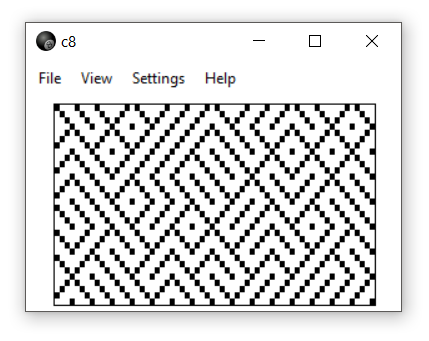

# c8
> Chip8 - interpreter

> **CHIP-8** is an interpreted programming language, developed by Joseph Weisbecker. It was initially used on the COSMAC VIP and Telmac 1800 8-bit microcomputers in the mid-1970s. CHIP-8 programs are run on a CHIP-8 virtual machine. It was made to allow video games to be more easily programmed for said computers.
> > *Wikipedia*

c8 is c++14 application and is maintained undef Windows and Linux. It uses [Nana C++][nanacpp] as the GUI library.

Features:
* **drag&drop** drag `rom` file on the binary file or on the display area
* **auto-resizing** the display area will automatically fit to the window's size
* **themes** you can choose display theme; `light`, `dark` or `matrix`
* **scaling** use [hqx][hqx] for scaling display up to `256x128 px`
* **clock** choose how fast clock should tick, between `64Hz` and `1024Hz`

[hqx]: https://en.wikipedia.org/wiki/Hqx
[nanacpp]: https://github.com/cnjinhao/nana

